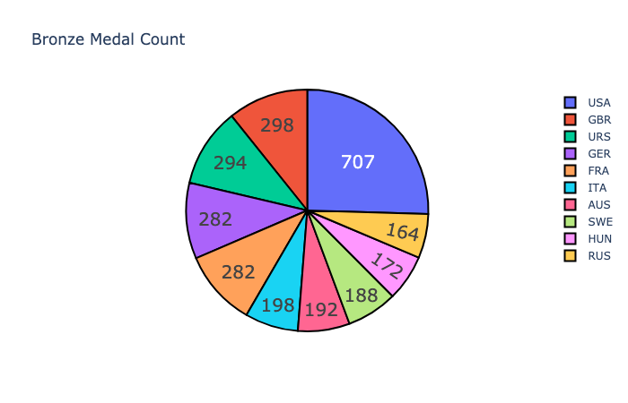

A quick look at the development of the Olympics: Women vs Men, Young vs Old, Sweden’s participation, and more.

```python
import numpy as np
import pandas as pd
import matplotlib.pyplot as plt
import plotly.graph_objects as go
import seaborn as sns

sns.set(rc={"figure.figsize": (11.7, 8.27)})
import os
```


```python
pathname = os.getcwd()
df = pd.read_csv(pathname + "/athlete_events.csv", delimiter=",")
df_country = pd.read_csv(pathname + "/noc_regions.csv", delimiter=",")
```


```python
df.info()
```

    <class 'pandas.core.frame.DataFrame'>
    RangeIndex: 271116 entries, 0 to 271115
    Data columns (total 15 columns):
     #   Column  Non-Null Count   Dtype  
    ---  ------  --------------   -----  
     0   ID      271116 non-null  int64  
     1   Name    271116 non-null  object 
     2   Sex     271116 non-null  object 
     3   Age     261642 non-null  float64
     4   Height  210945 non-null  float64
     5   Weight  208241 non-null  float64
     6   Team    271116 non-null  object 
     7   NOC     271116 non-null  object 
     8   Games   271116 non-null  object 
     9   Year    271116 non-null  int64  
     10  Season  271116 non-null  object 
     11  City    271116 non-null  object 
     12  Sport   271116 non-null  object 
     13  Event   271116 non-null  object 
     14  Medal   39783 non-null   object 
    dtypes: float64(3), int64(2), object(10)
    memory usage: 31.0+ MB


```python
print(df.head())
```

       ID                      Name Sex   Age  Height  Weight            Team  \
    0   1                 A Dijiang   M  24.0   180.0    80.0           China   
    1   2                  A Lamusi   M  23.0   170.0    60.0           China   
    2   3       Gunnar Nielsen Aaby   M  24.0     NaN     NaN         Denmark   
    3   4      Edgar Lindenau Aabye   M  34.0     NaN     NaN  Denmark/Sweden   
    4   5  Christine Jacoba Aaftink   F  21.0   185.0    82.0     Netherlands   
    
       NOC        Games  Year  Season       City          Sport  \
    0  CHN  1992 Summer  1992  Summer  Barcelona     Basketball   
    1  CHN  2012 Summer  2012  Summer     London           Judo   
    2  DEN  1920 Summer  1920  Summer  Antwerpen       Football   
    3  DEN  1900 Summer  1900  Summer      Paris     Tug-Of-War   
    4  NED  1988 Winter  1988  Winter    Calgary  Speed Skating   
    
                                  Event Medal  
    0       Basketball Men's Basketball   NaN  
    1      Judo Men's Extra-Lightweight   NaN  
    2           Football Men's Football   NaN  
    3       Tug-Of-War Men's Tug-Of-War  Gold  
    4  Speed Skating Women's 500 metres   NaN  


```python
print("The dataset has {} rows and {} columns.".format(df.shape[0], df.shape[1]))
```

    The dataset has 271116 rows and 15 columns.


```python
df.Season.value_counts()
```


    Summer    222552
    Winter     48564
    Name: Season, dtype: int64


```python
dfs = df[df.Season == "Summer"].copy()
dfw = df[df.Season == "Winter"].copy()
```

### Summer Olympics


```python
summer_sports = sorted(dfs.Sport.unique())
for num in range(0, len(summer_sports)):
    print("{}: {}".format(num + 1, summer_sports[num]))
```

    1: Aeronautics
    2: Alpinism
    3: Archery
    4: Art Competitions
    5: Athletics
    6: Badminton
    7: Baseball
    8: Basketball
    9: Basque Pelota
    10: Beach Volleyball
    11: Boxing
    12: Canoeing
    13: Cricket
    14: Croquet
    15: Cycling
    16: Diving
    17: Equestrianism
    18: Fencing
    19: Figure Skating
    20: Football
    21: Golf
    22: Gymnastics
    23: Handball
    24: Hockey
    25: Ice Hockey
    26: Jeu De Paume
    27: Judo
    28: Lacrosse
    29: Modern Pentathlon
    30: Motorboating
    31: Polo
    32: Racquets
    33: Rhythmic Gymnastics
    34: Roque
    35: Rowing
    36: Rugby
    37: Rugby Sevens
    38: Sailing
    39: Shooting
    40: Softball
    41: Swimming
    42: Synchronized Swimming
    43: Table Tennis
    44: Taekwondo
    45: Tennis
    46: Trampolining
    47: Triathlon
    48: Tug-Of-War
    49: Volleyball
    50: Water Polo
    51: Weightlifting
    52: Wrestling


How many sports have occurred at each summer olympics and how many participating countries?


```python
part_countries = dfs.groupby("Games").NOC.unique()
olympic_years = sorted(dfs.Games.unique())
years = sorted(dfs.Year.unique())
sports_count = dfs.groupby("Games").Sport.unique()
x = [len(x) for x in part_countries]
y = [len(x) for x in sports_count]
z = [x for x in years]
test = pd.DataFrame({"Years": z, "Sports": y, "Countries": x})
```


```python
plt.xticks(rotation=45)
sns.barplot(x="Years", y="Countries", data=test).set_title(
    "Number of Participating Countries"
);
```


```python
plt.xticks(rotation=45)
sns.barplot(x="Years", y="Sports", data=test).set_title("Number of Sports");
```


What's the medal count look like per country for the Summer Olympics?


```python
bronze_lst = []
silver_lst = []
gold_lst = []
country_lst = []
for country in dfs.NOC.unique():
    bronze_count = dfs[(dfs.NOC == country) & (dfs.Medal == "Bronze")]["ID"].count()
    silver_count = dfs[(dfs.NOC == country) & (dfs.Medal == "Silver")]["ID"].count()
    gold_count = dfs[(dfs.NOC == country) & (dfs.Medal == "Gold")]["ID"].count()
    country_lst.append(country)
    bronze_lst.append(bronze_count)
    silver_lst.append(silver_count)
    gold_lst.append(gold_count)
```


```python
df_medal = pd.DataFrame(
    {
        "Country": country_lst,
        "Bronze": bronze_lst,
        "Silver": silver_lst,
        "Gold": gold_lst,
    }
)

df_medal["Tot"] = df_medal["Bronze"] + df_medal["Silver"] + df_medal["Gold"]
```


```python
df_bronze_print = df_medal.sort_values(by=["Bronze"], ascending=False).head(10)
df_silver_print = df_medal.sort_values(by=["Silver"], ascending=False).head(10)
df_gold_print = df_medal.sort_values(by=["Gold"], ascending=False).head(10)
df_tot_print = df_medal.sort_values(by=["Tot"], ascending=False).head(10)
```


```python
fig = go.Figure(
    data=[go.Pie(labels=df_bronze_print["Country"], values=df_bronze_print["Bronze"])]
)
fig.update_traces(
    hoverinfo="label+percent",
    textinfo="value",
    textfont_size=20,
    marker=dict(line=dict(color="#000000", width=2)),
)
fig.update_layout(title_text="Bronze Medal Count")
fig.show("png")
```


```python
fig = go.Figure(
    data=[go.Pie(labels=df_silver_print["Country"], values=df_silver_print["Silver"])]
)
fig.update_traces(
    hoverinfo="label+percent",
    textinfo="value",
    textfont_size=20,
    marker=dict(line=dict(color="#000000", width=2)),
)
fig.update_layout(title_text="Silver Medal Count")
fig.show("png")
```


```python
fig = go.Figure(
    data=[go.Pie(labels=df_gold_print["Country"], values=df_gold_print["Gold"])]
)
fig.update_traces(
    hoverinfo="label+percent",
    textinfo="value",
    textfont_size=20,
    marker=dict(line=dict(color="#000000", width=2)),
)
fig.update_layout(title_text="Gold Medal Count")
fig.show("png")
```


```python
fig = go.Figure(
    data=[go.Pie(labels=df_tot_print["Country"], values=df_tot_print["Tot"])]
)
fig.update_traces(
    hoverinfo="label+percent",
    textinfo="value",
    textfont_size=20,
    marker=dict(line=dict(color="#000000", width=2)),
)
fig.update_layout(title_text="Total Medal Count")
fig.show("png")
```


##### Change to medals per event and not per person

The above graphs obviously take into account the number of athletes that receive a medal, that is a team event generates a higher number of medal than an individual event.


```python
df_med = dfs[["NOC", "Games", "Sport", "Event", "Medal"]].drop_duplicates(keep="first")
```


```python
print(dfs.columns)
```

    Index(['ID', 'Name', 'Sex', 'Age', 'Height', 'Weight', 'Team', 'NOC', 'Games',
           'Year', 'Season', 'City', 'Sport', 'Event', 'Medal'],
          dtype='object')


```python
bronze_lst2 = []
silver_lst2 = []
gold_lst2 = []
country_lst2 = []
for country in df_med.NOC.unique():
    bronze_count2 = df_med[(df_med.NOC == country) & (df_med.Medal == "Bronze")][
        "Event"
    ].count()
    silver_count2 = df_med[(df_med.NOC == country) & (df_med.Medal == "Silver")][
        "Event"
    ].count()
    gold_count2 = df_med[(df_med.NOC == country) & (df_med.Medal == "Gold")][
        "Event"
    ].count()
    country_lst2.append(country)
    bronze_lst2.append(bronze_count2)
    silver_lst2.append(silver_count2)
    gold_lst2.append(gold_count2)

df_medal2 = pd.DataFrame(
    {
        "Country": country_lst2,
        "Bronze": bronze_lst2,
        "Silver": silver_lst2,
        "Gold": gold_lst2,
    }
)

df_medal2["Tot"] = df_medal2["Bronze"] + df_medal2["Silver"] + df_medal2["Gold"]
df_bronze_print2 = df_medal2.sort_values(by=["Bronze"], ascending=False).head(10)
df_silver_print2 = df_medal2.sort_values(by=["Silver"], ascending=False).head(10)
df_gold_print2 = df_medal2.sort_values(by=["Gold"], ascending=False).head(10)
df_tot_print2 = df_medal2.sort_values(by=["Tot"], ascending=False).head(10)
```


```python
fig = go.Figure(
    data=[go.Pie(labels=df_bronze_print2["Country"], values=df_bronze_print2["Bronze"])]
)
fig.update_traces(
    hoverinfo="label+percent",
    textinfo="value",
    textfont_size=20,
    marker=dict(line=dict(color="#000000", width=2)),
)
fig.update_layout(title_text="Bronze Medal Count")
fig.show("png")
```





```python
fig = go.Figure(
    data=[go.Pie(labels=df_silver_print2["Country"], values=df_silver_print2["Silver"])]
)
fig.update_traces(
    hoverinfo="label+percent",
    textinfo="value",
    textfont_size=20,
    marker=dict(line=dict(color="#000000", width=2)),
)
fig.update_layout(title_text="Silver Medal Count")
fig.show("png")
```


```python
fig = go.Figure(
    data=[go.Pie(labels=df_gold_print2["Country"], values=df_gold_print2["Gold"])]
)
fig.update_traces(
    hoverinfo="label+percent",
    textinfo="value",
    textfont_size=20,
    marker=dict(line=dict(color="#000000", width=2)),
)
fig.update_layout(title_text="Gold Medal Count")
fig.show("png")
```


```python
fig = go.Figure(
    data=[go.Pie(labels=df_tot_print2["Country"], values=df_tot_print2["Tot"])]
)
fig.update_traces(
    hoverinfo="label+percent",
    textinfo="value",
    textfont_size=20,
    marker=dict(line=dict(color="#000000", width=2)),
)
fig.update_layout(title_text="Total Medal Count")
fig.show("png")
```


##### Distribution of medals over age

Lets take a look at the distribution of medals over the age of the participants:


```python
sns.histplot(data=dfs, x="Age", hue="Sex", bins=50).set_title("Age distribution");
```


As can be observed, the shape of the distribution are quite similar for women and men - with women not having participated in the Olympics for the same amount of time, thus creating the difference in the number of medals. The women are a little bit more skewed to the younger ages as there are a larger amount of medals in the below 20 year olds for them compared to the men.

##### Looking at which sports favors the oldest and which sports favor the youngest


```python
df_oldest = dfs[dfs["Age"] >= 60]
df_youngest = dfs[dfs["Age"] <= 18]
```


```python
print(df_oldest.Event.value_counts().reset_index(name="Medal").head(10))
```

                                                   index  Medal
    0     Art Competitions Mixed Painting, Unknown Event    172
    1  Art Competitions Mixed Sculpturing, Unknown Event    107
    2         Art Competitions Mixed Painting, Paintings     67
    3        Art Competitions Mixed Sculpturing, Statues     29
    4                 Art Competitions Mixed Sculpturing     23
    5  Art Competitions Mixed Painting, Drawings And ...     22
    6           Equestrianism Mixed Dressage, Individual     16
    7  Art Competitions Mixed Architecture, Architect...     14
    8  Art Competitions Mixed Architecture, Designs F...     13
    9  Art Competitions Mixed Architecture, Unknown E...     11


Historically participants who are 60+ years of age at the time of their olympic games participation have taken the most medals in Art Competitions. I didn't even know that there were such a thing as Art Competitions in the Olympics but a quick google led me to some more information, for further information see:
https://en.wikipedia.org/wiki/Art_competitions_at_the_Summer_Olympics


```python
print(df_youngest.Event.value_counts().reset_index(name="Medal").head(10))
```

                                                 index  Medal
    0         Gymnastics Women's Individual All-Around    843
    1                   Gymnastics Women's Uneven Bars    832
    2                Gymnastics Women's Floor Exercise    827
    3                  Gymnastics Women's Balance Beam    825
    4               Gymnastics Women's Team All-Around    731
    5                   Gymnastics Women's Horse Vault    723
    6  Swimming Women's 4 x 100 metres Freestyle Relay    575
    7     Swimming Women's 4 x 100 metres Medley Relay    490
    8            Swimming Women's 100 metres Freestyle    463
    9           Swimming Women's 100 metres Backstroke    372


For participants who are 18 or younger, the women's gymnastic and swimming events have produced the most medals. If we look at the oldest and youngest in the 2000's:


```python
df_oldest_2000 = dfs[(dfs["Age"] >= 60) & (dfs["Year"] >= 2000)]
df_youngest_2000 = dfs[(dfs["Age"] <= 18) & (dfs["Year"] >= 2000)]
```


```python
print(df_oldest_2000.Event.value_counts().reset_index(name="Medal").head(10))
```

                                                   index  Medal
    0           Equestrianism Mixed Dressage, Individual      5
    1            Equestrianism Mixed Jumping, Individual      4
    2                  Equestrianism Mixed Jumping, Team      4
    3                 Equestrianism Mixed Dressage, Team      3
    4        Shooting Men's Rapid-Fire Pistol, 25 metres      2
    5                           Archery Men's Individual      1
    6                                Shooting Men's Trap      1
    7          Equestrianism Mixed Three-Day Event, Team      1
    8    Equestrianism Mixed Three-Day Event, Individual      1
    9  Shooting Men's Small-Bore Rifle, Prone, 50 metres      1


During the 2000s for participants 60+ we can see that equestrianism and different shooting/archery-events are the events wherein they obtain the most medals.


```python
print(df_youngest_2000.Event.value_counts().reset_index(name="Medal").head(10))
```

                                                 index  Medal
    0         Gymnastics Women's Individual All-Around    250
    1                   Gymnastics Women's Uneven Bars    243
    2                Gymnastics Women's Floor Exercise    242
    3                  Gymnastics Women's Balance Beam    240
    4               Gymnastics Women's Team All-Around    211
    5                Rhythmic Gymnastics Women's Group    169
    6                   Gymnastics Women's Horse Vault    136
    7             Swimming Women's 50 metres Freestyle    128
    8  Swimming Women's 4 x 200 metres Freestyle Relay     87
    9     Swimming Women's 4 x 100 metres Medley Relay     77


For the 2000s, the participants who are 18 or below is roughly the same sports as it has been historically, i.e. gymnastics, rhytmic gymnastics as well as swimming. As can be observed here again - women are dominant in receiving medals when 18 or younger as no men's event is in the top 10 in this list.

##### Women medals per olympic games

We observed in the above histogram that women have received fewer medals in total than men. So now let's take a look at the historical development for women.


```python
df_w = dfs[dfs.Sex == "F"]
w_n_events = [len(x) for x in df_w.groupby("Year").Event.unique()]
w_n_parts = [x for x in df_w.groupby("Year").apply(lambda x: len(x["Name"].unique()))]
w_y_events = [int(x) for x in sorted(df_w.Year.unique())]
df_w_pa = pd.DataFrame(
    {
        "Year": w_y_events,
        "Number of events": w_n_events,
        "Number of participants": w_n_parts,
    }
)
```


```python
print(df_w_pa.head())
```

       Year  Number of events  Number of participants
    0  1900                 8                      23
    1  1904                 3                       6
    2  1906                 2                       6
    3  1908                 7                      44
    4  1912                 7                      53


So women first participated at the 1900 Summer Olympics in Paris, France. Let's look at the number of events held for the women over time:


```python
plt.xticks(rotation=45)
sns.barplot(x="Year", y="Number of events", data=df_w_pa).set_title("Number of Events");
```


```python
plt.xticks(rotation=45)
sns.barplot(x="Year", y="Number of participants", data=df_w_pa).set_title(
    "Number of Participants"
);
```


Putting these numbers into percentages as of all events and participants during these years:


```python
df_m = dfs[(dfs.Sex == "M") & (dfs.Year >= w_y_events[0])]
m_n_events = [len(x) for x in df_m.groupby("Year").Event.unique()]
m_n_parts = [x for x in df_m.groupby("Year").apply(lambda x: len(x["Name"].unique()))]
m_y_events = [int(x) for x in sorted(df_m.Year.unique())]
df_pa_tot = pd.DataFrame(
    {
        "Year": m_y_events,
        "Nm_events": m_n_events,
        "Nm_part": m_n_parts,
        "Nw_events": w_n_events,
        "Nw_part": w_n_parts,
    }
)

df_pa_tot["Tot_part"] = df_pa_tot["Nm_part"] + df_pa_tot["Nw_part"]
df_pa_tot["Tot_events"] = df_pa_tot["Nm_events"] + df_pa_tot["Nw_events"]
df_pa_tot["Prc_w_part"] = 100 * df_pa_tot["Nw_part"] / df_pa_tot["Tot_part"]
df_pa_tot["Prc_w_events"] = 100 * df_pa_tot["Nw_events"] / df_pa_tot["Tot_events"]
df_pa_tot["Prc_m_part"] = 100 * df_pa_tot["Nm_part"] / df_pa_tot["Tot_part"]
df_pa_tot["Prc_m_events"] = 100 * df_pa_tot["Nm_events"] / df_pa_tot["Tot_events"]
```


```python
print(df_pa_tot.tail())
```

        Year  Nm_events  Nm_part  Nw_events  Nw_part  Tot_part  Tot_events  \
    23  2000        180     6576        128     4064     10640         308   
    24  2004        176     6252        132     4288     10540         308   
    25  2008        175     6284        135     4603     10887         310   
    26  2012        170     5858        140     4646     10504         310   
    27  2016        170     6143        145     5031     11174         315   
    
        Prc_w_part  Prc_w_events  Prc_m_part  Prc_m_events  
    23   38.195489     41.558442   61.804511     58.441558  
    24   40.683112     42.857143   59.316888     57.142857  
    25   42.279783     43.548387   57.720217     56.451613  
    26   44.230769     45.161290   55.769231     54.838710  
    27   45.024163     46.031746   54.975837     53.968254  


```python
plt.plot(df_pa_tot.Year, df_pa_tot.Prc_w_part, label="% women of total participants")
plt.plot(
    df_pa_tot.Year, df_pa_tot.Prc_w_events, label="% womens events of total events"
)
plt.plot(df_pa_tot.Year, df_pa_tot.Prc_m_part, label="% men of total participants")
plt.plot(df_pa_tot.Year, df_pa_tot.Prc_m_events, label="% mens events of total events")
plt.axhline(y=50, color="k", linestyle="-", label="50%")
plt.xlabel("Years")
plt.ylabel("Percentage")
plt.title("Women's and Men's events and participants in percentages throughout time")
plt.ylim([0, 100])
plt.xlim([1900, 2016])
plt.legend()
plt.savefig("WomenMenDevelopment.png")
plt.show()
```


As can be observed, the women represented a fraction of participants in the beginning of the 1900s but have gradually taking a larger and larger part. The black line, showing 50%, is where the men and women are trending as the percentages of both events and participants are getting closer and closer.

##### Sweden distribution medals over events, number of participants and events

The following list shows top 10 number of medals per event descending:


```python
df_SWE_n = dfs.loc[dfs["NOC"] == "SWE"]
df_SWE = df_med.loc[df_med["NOC"] == "SWE"]
print(df_SWE.Event.value_counts().reset_index(name="Medal").head(10))
```

                                                index  Medal
    0              Modern Pentathlon Men's Individual     40
    1             Cycling Men's Road Race, Individual     29
    2             Swimming Men's 100 metres Freestyle     27
    3                       Athletics Men's High Jump     26
    4                  Fencing Men's epee, Individual     25
    5       Wrestling Men's Middleweight, Greco-Roman     25
    6  Wrestling Men's Light-Heavyweight, Greco-Roman     24
    7                      Athletics Men's Pole Vault     23
    8                   Athletics Men's Javelin Throw     23
    9           Swimming Women's 100 metres Freestyle     22


```python
olympic_years = sorted(df_SWE_n.Games.unique())
years = sorted(df_SWE_n.Year.unique())
sports_count = df_SWE_n.groupby("Games").Sport.unique()
swe_parts = df_SWE_n.groupby("Games")["NOC"].count()
y = [len(x) for x in sports_count]
z = [x for x in years]
w = [x for x in swe_parts]
test = pd.DataFrame({"Years": z, "Sports": y, "Swedish Participants": w})
```


```python
plt.xticks(rotation=45)
sns.barplot(x="Years", y="Swedish Participants", data=test).set_title(
    "Number of Swedish Participants throughout history"
)
plt.savefig("SwedishParticipants.png")
```


1912, the year in which the spike can be observed in the above barplot, the Summer Olympics was hosted in Stockholm, Sweden.

##### Age distribution of Swedish medalists and Swedish participants in total


```python
dfs_SWE_med = dfs[(dfs["NOC"] == "SWE") & (dfs["Medal"].notna())]
```


```python
swe_tot = [x for x in df_SWE_n["Age"]]
swe_medals = [x for x in dfs_SWE_med["Age"]]
```

As can be observed in the plot below, the age distribution for the medalists follows closely that of the participants.


```python
plt.hist([swe_tot, swe_medals], bins=30)
plt.title(
    "Age distribution of Swedish participants and Swedish medalists at the Olympics"
)
plt.legend(["Participants", "Medalists"]);
```


##### Youngest and Oldest Swedish medalists

The youngest ever Swedish medalists in the Olympics is Nils Skoglund, taking a Silver medal in Men's Diving at the 1920's Olympics in Antwerpen at the age of 13.


```python
dfs_SWE_med.sort_values(by="Age").iloc[0, :]
```


    ID                         111715
    Name                Nils Skoglund
    Sex                             M
    Age                          13.0
    Height                        NaN
    Weight                        NaN
    Team                       Sweden
    NOC                           SWE
    Games                 1920 Summer
    Year                         1920
    Season                     Summer
    City                    Antwerpen
    Sport                      Diving
    Event     Diving Men's Plain High
    Medal                      Silver
    Name: 222373, dtype: object


The oldest ever Swedish medalists in the Olympics is Oscar Swahn, taking a Silver medal in Shooting at the 1920's Olympics in Antwerpen at the age of 72.


```python
dfs_SWE_med.sort_values(by="Age").iloc[-1, :]
```


    ID                                                  117046
    Name                                     Oscar Gomer Swahn
    Sex                                                      M
    Age                                                   72.0
    Height                                                 NaN
    Weight                                                 NaN
    Team                                                Sweden
    NOC                                                    SWE
    Games                                          1920 Summer
    Year                                                  1920
    Season                                              Summer
    City                                             Antwerpen
    Sport                                             Shooting
    Event     Shooting Men's Running Target, Double Shot, Team
    Medal                                               Silver
    Name: 233395, dtype: object


